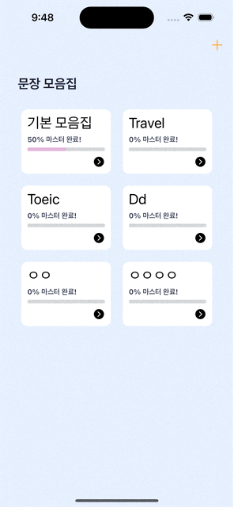
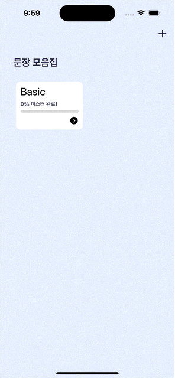
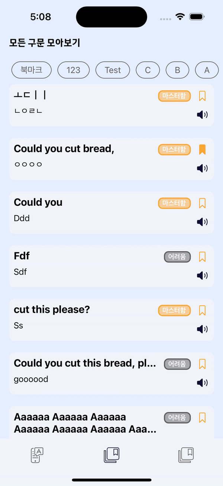

# 언어급행(README)

<aside>
🚆 OCR로 쉽게 외국어 구문을 저장하고 열람할 수 있는 iOS App
</aside>


## **💻** 프로젝트 세부사항

### 개발 기간

*24.03.07 ~ 24.03.24 (2주)*

- 업데이트 진행중

### 개발 배경

> 릴스나 쇼츠에서 알려주는 영어 표현을 “오, 이렇게 말하는구나!”하며 그때만 깨닫고 기억에서 휘발되는 점이 아쉬웠습니다. 그리고 글로 옮기기에 번거롭고 스크린샷을 찍어놓아도 잘 보지 않는 문제점도 있었습니다.
> 
> 
> 문제점을 해결하기 위하여 스크린샷을 활용해서 쉽게 외국어 구문을 저장하고, 원하는 형태로 쉽게 구문을 열람할 수 있는 외국어 구문 아카이빙 앱이 있으면 좋겠다는 아이디어로 만들었습니다.
> 

### 앱스토어 링크

https://bit.ly/languageexpress


### 개발 환경

```
- Swift 5.0
- XCode 15.3
- macOS Sonoma 14.5
- 최소 지원 버전 : iOS 16.0
- 디자인 툴 : Adobe XD
- 버전 관리 : Github, GitFlow
```

### 기술 스택 및 라이브러리

- `UIKit`, `SnapKit`
- `Realm`
- `VisionKit`
- `AVFoundation`
- `Compositional Layout`
- `StoreKit`
- `FirebaseAnalytics`, `FirebaseCrashlytics`

### 아키텍처

- MVVM
- Method Factory Pattern
- Builder Pattern

---

## 📱 구현 기능

- 외국어 구문 추가/조회
-  OCR로 구문 추가
-  학습 기능
  -  TTS 발음 듣기
  -  암기 정도 체크
-  북마크/태그 필터링

  ! 


### 개발 고려 사항

- **Custom Observable Binding**을 이용하여 비즈니스 로직 분리 (RxSwift 변환중)
- UIViewController와 UIView 분리
- **VisionKit**을 이용하여 영어 텍스트 OCR 기능 구현
- **Realm**을 이용하여 로컬DB 스키마 구축 및 로컬데이터 관리
- **Protocol**을 활용하여 Delegate 패턴, Method Factory 패턴 구현
- **Builder** 패턴으로 커스텀 알럿 구현
- **final** 접근 제어자를 활용하여 비상속 클래스 선언 및 효율적 메모리 사용
- **Repository**를 이용하여 데이터 의존성을 낮추고 유지보수에 용이한 코드 작성

### 업데이트 사항

**Ver 1.1.0**

- 모든 구문에 대해 북마크 및 태그에 따라 필터링 조회 기능 추가
- 오류 수정 및 사용성 개선

---

## **☄️ 트러블 슈팅**

### 1️⃣ 사용자 터치 순서 제약없이 인식된 텍스트를 문장 조합하기

사진으로 구문 추가하기 기능에서 사용자가 순서대로 단어들을 선택하지 않아도, 순서대로 문장을 조합시킴으로써 UX 개선

**해결 방법**

1. 사용자가 텍스트 영역을 문장 순서대로 선택한다는 보장이 없고, 빈번히 선택 해제를 할 수 있으므로 순서는 필요없다 판단하여 Set으로 선택된 텍스트 관리
    - 또한, Set은 해싱에 의해 데이터를 매핑하기 때문에 append, remove 메서드의 시간 복잡도는 O(1)으로 효율성 ⬆
2. **그러나**, 단순히 텍스트를 String으로 저장하는 Set을 활용하면 동의어가 중복되었을 때 구분을 해줄 수 없는 또 다른 문제 발생
   
    ⇒ 인식된 텍스트와 고유 ID를 프로퍼티로 가지는 구조체를 정의하여 Set의 Element로 채택
    
3. 유저가 인식된 텍스트 선택 완료 버튼 클릭 시, Set에 저장된 인식된 단어들을 고유 ID 오름차순으로 정렬하여 해결
    - 고유 ID 값 의미: OCR프로세서로부터 인식된 텍스트 결과값들이 UIKit 좌표계 시스템대로 좌측상단을 기준으로 이미 정렬되어 있어, 순차적인 인덱스를 `identifier` 프로퍼티에 할당
    - 유저가 대체적으로 좌측상단으로 정렬된 텍스트 이미지를 불러올 확률이 높다고 생각하여 단어 정렬 기준으로 위 방법을 채택

**배운 점**

구조체를 Set의 Element로 사용할 때는 Hashable 프로토콜 준수 필수

- Set은 해싱이 보장되어야 하므로
- 기본 자료형인 String, Int, Double, enum도 Hashable 준수함.

